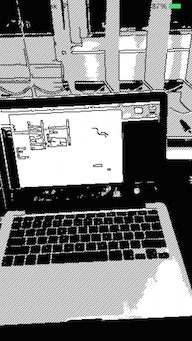

# RealtimeFilterExample

A Sample iOS project for Realtime Capture Effect of OpenCV. (Swift & Objective-c)

## Requirements

* Xcode 7.0
* iOS 8.0+
* Swift 2.0

## License

MIT license. See the LICENSE file for more info.
